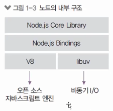
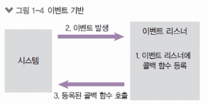
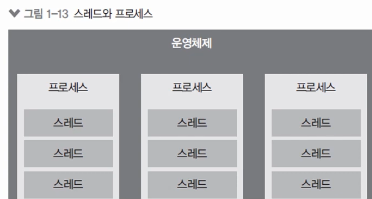
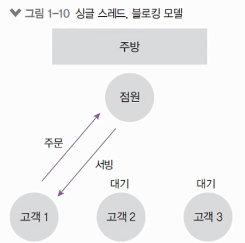
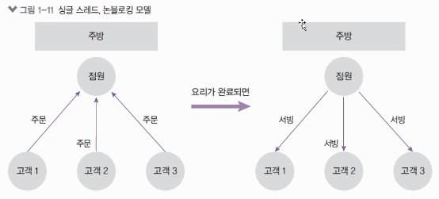
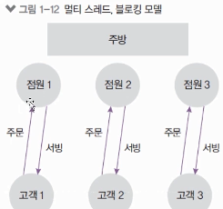
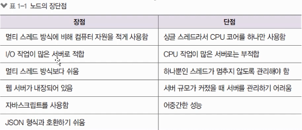
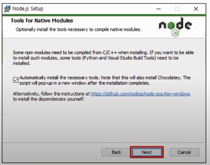

# 🚑 1장. 노드 시작하기
## 🔨 1. 노드의 정의
### 1) 노드의 정의
: Node.js는 크롬 V8 자바스크립트 엔진으로 빌드된 자바스크립트 런타임(실행기)이다.
> 서버가 아님, 노드로 인해서 js는 html이나 브라우저의 종속성에서 벗어남.

- 서버의 역할도 수행할 수 있는 자바스크립트 런타임
- 노드로 자바스크립트로 작성된 서버를 실행할 수 있다.
- 서버 실행을 위해 필요한 http/https/http2 모듈을 제공한다.

### 2) 런타임
#### 🔒 노드 : 자바스크립트 런타임
- 런타임\
: 특정 언어로 만든 프로그램들을 실행할 수 있게 해주는 가상 머신(크롬의 V8 엔진 사용)의 상태\
=> 따라서 노드는 자바스크립트로 만든 프로그램들을 실행할 수 있게 해준다.
- 다른 런타임\
: 웹브라우저(크롬, 엣지, 사파리, 파이어폭스 등)가 있음\
: 노드 이전에도 자바스크립트 런타임을 만들기 위해 많은 시도를 했지만, 엔진 속도 문제로 실패했다.
> 참고 : 디노(deno)는 타입스크립트의 런타임
### 3) 내부 구조
: C/C++로 만들어져있음 (속도 때문)
- 2008년 V8 엔진 출시, 2009년 노드 프로젝트 시작
- 노드는 V8과 libuv를 내부적으로 포함한다.
    - V8 엔진 : 오픈 소스 자바스크립트 엔진 -> 속도 문제 개선
    - libuv : 노드의 특성인 이벤트 기반, 논블로킹 I/O 모델을 구현한 라이브러리

    

---

## 🔨 2. 노드의 특징
### 1) 이벤트 기반
: 이벤트가 발생할 때 미리 지정해둔 작업을 수행하는 방식
> ex) 클릭, 네트워크 요청, 타이머 등

- 이벤트 리스너\
: 이벤트를 등록하는 함수
- 콜백 함수\
: 이벤트가 발생했을 때 실행될 함수

    

### 2) 논블로킹 I/O
#### 🔥 노드는 블로킹이면서 동기 or 논블로킹이면서 비동기 🔥

- 논 블로킹\
: 오래 걸리는 함수를 백그라운드로 보내서 다음 코드가 먼저 실행되게 하고, 나중에 오래 걸리는 함수를 실행한다.\
=> 코드가 순서대로 실행되지 않을 수도 있다.\
: 논 블로킹 방식 하에서 일부 코드는 백그라운드에서 병렬로 실행됨.
    - 일부 코드?\
    : I/O 작업(파일 시스템 접근, 네트워크 요청), 압축, 암호화 등
    - 나머지 코드\
    : 블로킹 방식으로 실행된다.

    => 따라서, I/O 작업이 많을 때 노드 활용성이 극대화 된다.

- 블로킹\
: 코드가 순서대로 실행된다.
- 동기\
: 코드가 순서대로 실행된다.
- 비동기\
: 코드가 순서대로 실행되지 않는다.


### 3) 프로세스 vs 스레드
- 프로세스\
: 운영체제에서 할당하는 작업의 단위\
: 프로세스 간 자원 공유 X\
: 프로그램 하나 실행하면 프로세스가 하나 뜬다!\
ex) 크롬창 띄우기

- 스레드\
: 프로세스 내에서 실행되는작업의 단위\
: 부모 프로세스 자원 공유 O\
: 여러개가 뜬다!\
ex) 크롬창 띄웠을 때 여러개의 탭들

#### 🔒 노드는 싱글 스레드!
: 노드 프로세스는 멀티 스레드지만, 직접 다룰 수 있는 스레드는 하나기 때문에 싱글 스레드라고 표현한다.

#### 🔒 노드는 주로 멀티 스레드 대신 멀티 프로세스를 활용!
: 노드는 14버전부터 멀티 스레드 사용 가능



### 4) 싱글 스레드
: 싱글 스레드라 주어진 일을 하나밖에 처리하지 못함\
=> 블로킹이 발생하는 경우, 나머지 작업은 모두 대기해야한다.\
==> 비효율 발생
#### ⚡️ 예시) 주방에 비유
- 점원 : 스레드
- 주문 : 요청
- 서빙 : 응답



### 🔥 노드에서의 싱글 스레드 
: 위와 같은 싱글 스레드의 비효율성을 줄이고자 나온 방법\
=> __논 블로킹 모델을 채택하여 일부 코드(I/O)를 백그라운드(다른 프로세스)에서 실행 가능__

✏️ 방식\
: 요청을 먼저 받고, 완료될 때 응답\
: I/O 관련 코드가 아닌 경우 싱글 스레드, 블로킹 모델과 같아진다.
> 대기표 느낌



✏️ 한계\
: 한 쪽으로 쏠려서 점원이 기절하면 안되기 때문에 점원 관리를 잘해야한다.!\
=> __스레드 관리를 잘해야한다.__

✏️ 해결방법\
: 점원이 하나인 체인점을 여러 개 만들어서 멀티 프로세싱한다.!\
=> __스레드가 하나인 노드 프로세스를 여러 개 만들어 멀티 프로세싱!__

#### 🔒 왜 싱글 스레드인 NODE를 사용하는가?
: 멀티 스레드를 해도 비동기 처리는 계속 해야한다.\
=> 멀티 스레드는 너무 어려운데 프로그램은 효율적으로 돌리고 싶어서 싱글 스레드인 노드를 하는 것!

### 5) 멀티 스레드 모델과의 비교
- 싱글 스레드 모델\
: 에러를 처리하지 못하는 경우 멈춘다.\
⬆️ but! 프로그래밍 난이도 쉽고, CPU 및 메모리 자원 적게 사용함

- 멀티 스레드 모델\
: 에러 발생 시 새로운 스레드를 생성하여 극복.\
⬇️ but, 새로운 스레드 생성이나 놀고 있는 스레드 처리에 비용 발생\
⬇️ 프로그래밍 난이도 어렵고, 스레드 수만큼 자원 사용 多

#### ⚡️ 예시) 주방에 비유
- 점원 : 스레드
- 주문 : 요청
- 서빙 : 응답



---

## 🔨 3. 노드의 역할
### 1) 서버로서의 노드 上
- 서버\
: 네트워크를 통해 클라이언트에 정보나 서비스를 제공하는 컴퓨터 또는 프로그램
- 클라이언트\
: 서버에 요청을 보내는 주체(브라우저, 데스크탑 프로그램, 모바일 앱, 다른 서버에 요청을 보내는 서버)

#### ⚡️ 예시
- 브라우저(클라이언트, 요청)가 네이버 웹사이트(서버, 응답)에 접속
- 핸드폰(클라이언트)을 통해 앱스토어(서버)에서 앱 다운로드

#### 🔥 노드 != 서버 🔥
: 하지만, 노드는 서버를 구성할 수 있게 하는 모듈이다.


### 2) 서버로서의 노드 下
- 노드 서버의 장단점\
: 노드, 자바스크립트의 장단점과 별반 다른 것이 없음.


> CPU 작업이 많은 것 처리가 힘들기 때문에 노드 측에서 멀티 스레드를 열어준 것!\
=> 진상 손님(알고리즘 처리 복잡, 암호화 등)

- CPU 작업을 위해 AWS Lamda나 Google Cloud Functions 같은 별도 서비스 사용
- 페이팔, 넷플릭스, 나사, 월마트, 링크드인, 우버 등에서 메인 or 서브 서버로 사용함.

### 3) 서버 외의 노드
: 자바스크립트 런타임이기 때문에 용도가 서버에만 한정되지 X.\
: 웹, 모바일, 데스크탑 애플리케이션에도 사용(아래 프레임 워크가 노드 기반으로 작동)
- 웹 프레임워크\
: Angular, React, Vue, Meteor
- 모바일 앱 프레임워크\
: React Native
- 데스크탑 개발 도구\
: Electron(Atom, Slack, VSCODE, Discord 등 제작)

---

## 🔨 4. 노드 설치하기
### 1) 홈페이지 접속 후 설치
#### 📝 WINDOW, MAC
: LTS는 안정된 버전, Current는 최신 버전(실험적)\
: https://nodejs.org

- 필요 도구 반드시 설치하기\


#### 📝 LINUX
: 터미널에 아래 코드 입력
```
sudo apt-get update
sudo apt-get install -y build-essential
sudo apt-get install curl
curl -sL https://deb.nodesource.com/setup_14.x | sudo -E bash --
sudo apt-get install -y node.js
```
### 2) 설치 완료 후 확인하기
: 버전이 뜨면 설치가 성공
```
node -v
npm -v
```
- npm 버전 업데이트
```
(sudo) npm install -g npm
```
> mac, linux는 명령어 앞에 sudo 붙이기