# 🚑 2장. 알아두어야 할 자바스크립트
## 🔨 1. 호출 스택, 이벤트 루프
### 1) 호출 스택
#### ⚡️ 예시
: 밑의 코드 순서 예측\
=> 세 번째 -> 두 번째 -> 첫 번째
``` js
function first() {
    second();
    console.log("첫 번째");
}

function second() {
    third();
    console.log("두 번째");
}

function third() {
    console.log("세 번째");
}

first();
```
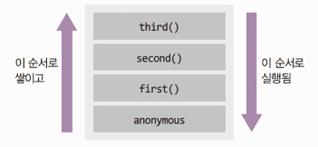

#### 🔒 호출 스택
: 함수의 호출, 자료 구조의 스택
- Anonymous은 가상은 전역 컨텍스트 (항상 있다고 생각하는게 좋음)
- 함수 호출 순서대로 쌓이고, 역순으로 실행됨
- 함수 실행이 완료되면 스택에서 빠짐
- LIFO 구조라서 스택이라 불림

### 2) 이벤트 루프(+ 호출 스택)
#### ⚡️ 예시2
: 밑의 코드 순서 예측\
=> 시작 -> 끝 -> 3초 후 실행
``` js
function run() {
    console.log("3초 후 실행");
}
console.log("시작");
setTimeout(run, 3000);
console.log("끝");
```
- 호출 스택만으로는 설명이 안 됨(run은 호출 X했는데?)\
=> 호출 스택 + 이벤트 루프로 설명 가능.

- 백그라운드로 가게 되면 호출 스택에서 다른 작업이 가능하다.\
: 이 때, 호출 스택이 백그라운드 보다 먼저 끝나야한다.

1. 실행 전 호출 스택에 anonymous 들어가기\
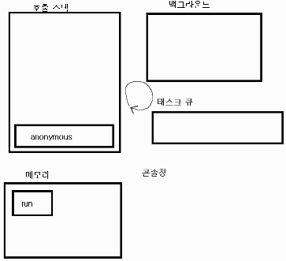

2. console.log 실행\
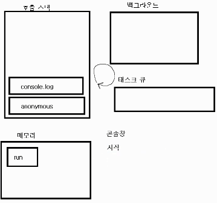

3. setTimeout 실행\
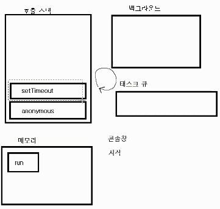

4. 백그라운드에 타이머(3초) 저장\
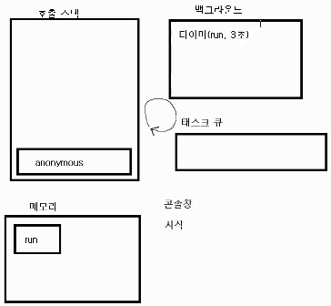

5. console.log 실행\
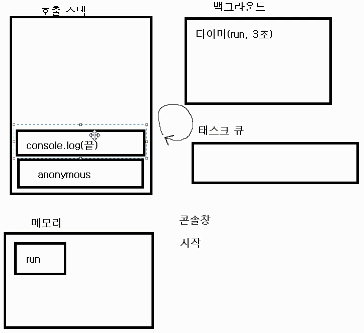

6. 코드 종료, anonymous 없어짐\


7. 3초 후 태스크 큐에 run 들어감\
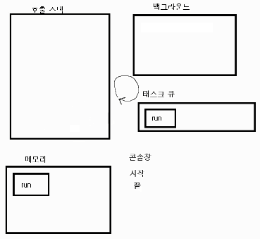

8. 호출 스택에 run 들어감(실행)\
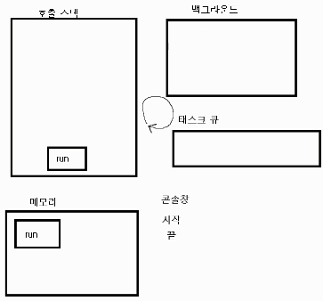

9. run 안의 console.log 실행\
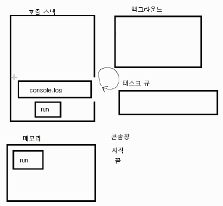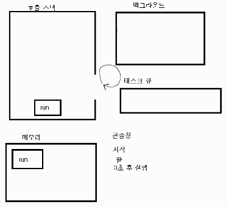

10. run 종료 및 JS 종료\
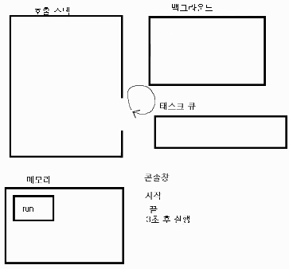

## 🔨 2. ES2015+ 문법
### 1) var, const
: ES2015 이전에는 var로 변수를 선언
=> but, ES2015부터는 const와 let이 대체
#### 🔒 기존 : 함수 스코프
: function() {}이 스코프의 기준점
- 다른 언어와는 달리 if나 for, while은 영향을 미치지 X.
- const와 let은 함수 및 블록({})에도 별도의 스코프를 가짐.\
=> function으로 감싸면 얘도 바깥으로 뛰쳐 나갈 수 X.
``` js
if (true) {
    var x = 3;
}
console.log(x); // 3
```
#### 🔒 ES2015 이후 : 블록 스코프
: 블록에서 선언 했으면 바깥에 뛰쳐 나갈 수 없음
``` js
if true {
    const y = 3;
}
console.log(y); // Uncaught ReferenceError: y is not defined
```

### 2) const, let
``` js
const a = 0;
a = 1; // Uncaught TypeError: Assignment to constant variable

let b = 0;
b = 1; // 1
const c; // Uncaught SyntaxError: Missing initializer in const declaration
```
#### 🔒 const는 상수
: 앵간하면 const로 선언하고 값 바꿀 일이 생기면 let으로 바꾸는것 추천
- 상수에 할당한 값은 다른 값으로 변경 불가
- 변경하고자 할 때는 let으로 변수 선언

### 3) 템플릿 문자열
: 전체를 백틱(`)으로 감싸고 변수를 ```${}```로 감싸준다.
``` js
const won = 1000;
const result = `이 과자는 ${won}원 입니다.`;

// 번거로운 예전 버전
var result = '이 과자는 ' + won + '원 입니다.'
```

- tagged template literal\
: ES2015 이후로 함수 호출 시 사용가능.
``` js
function a() {
    console.log("ㅋㅋ루삥뽕");
}

a();
a``;
```

### 4) 객체 리터널
#### 🔒 ES5 시절의 객체 표현 방법
: 속성 표현 방식 주목
``` js
var sayNode = function() {
    console.log("Node");
};

var es = "ES";
var oldObject = {
    sayJS: function {
        console.log("JS");
    },
    sayNode: sayNode,
};
oldObject[es + 6] = 'Fantastic'; // es는 동적 속성
oldObject.sayNode(); // Node
oldObject.sayJS(); // JS
console.log(oldObject.ES6); // Fantastic
```
#### 🔒 지금은 훨씬 간결한 문법으로 객체 리터럴 표현 가능
- 객체의 메서드에 function을 붙이지 않아도 된다.
- ```{ sayNode: sayNode }```처럼 키와 변수가 같은 것을 { sayNode }로 축약 가능.
- [변수 + 값] 등으로 동적 속성명을 객체 속성 명으로 사용 가능.
``` js
const newObject = {
    sayJs() {
        console.log("JS");
    },
    sayNode,
    [es + 6]: 'Fantastic', // es는 동적 속성
};
newObject.sayNode(); // Node
newObject.sayJs(); // JS
console.log(newObject.ES6); // Fantastic
```

### 5) 화살표 함수

## 🔨 3. 프런트엔드 자바스크립트