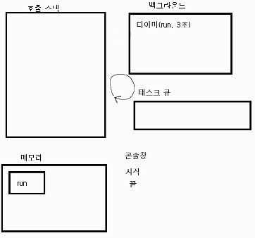

# 🚑 2장. 알아두어야 할 자바스크립트
## 🔨 1. 호출 스택, 이벤트 루프
### 1) 호출 스택
#### ⚡️ 예시
: 밑의 코드 순서 예측\
=> 세 번째 -> 두 번째 -> 첫 번째
``` js
function first() {
    second();
    console.log("첫 번째");
}

function second() {
    third();
    console.log("두 번째");
}

function third() {
    console.log("세 번째");
}

first();
```


#### 🔒 호출 스택
: 함수의 호출, 자료 구조의 스택
- Anonymous은 가상은 전역 컨텍스트 (항상 있다고 생각하는게 좋음)
- 함수 호출 순서대로 쌓이고, 역순으로 실행됨
- 함수 실행이 완료되면 스택에서 빠짐
- LIFO 구조라서 스택이라 불림

#### ⚡️ 예시2
: 밑의 코드 순서 예측\
=> 시작 -> 끝 -> 3초 후 실행
``` js
function run() {
    console.log("3초 후 실행");
}
console.log("시작");
setTimeout(run, 3000);
console.log("끝");
```
- 호출 스택만으로는 설명이 안 됨(run은 호출 X했는데?)\
=> 호출 스택 + 이벤트 루프로 설명 가능.

- 백그라운드로 가게 되면 호출 스택에서 다른 작업이 가능하다.\
: 이 때, 호출 스택이 백그라운드 보다 먼저 끝나야한다.





## 🔨 2. ES2015+ 문법
## 🔨 3. 프런트엔드 자바스크립트